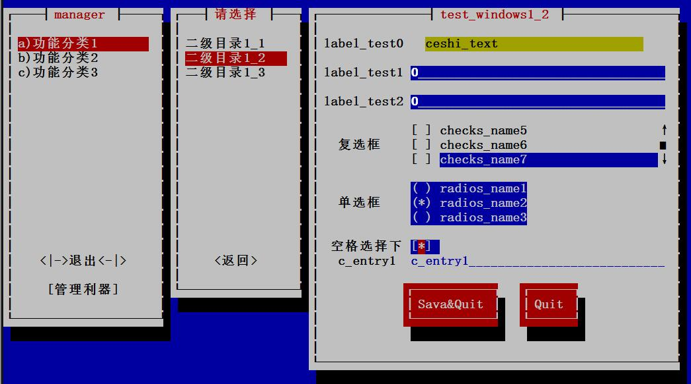

# py_menu

* [项目概述及展示](#项目概述及展示)
* [usage](#usage)
* [输出结果](#输出结果)
* [version](#version)
* [参加步骤](#参加步骤)
* [小额捐款](#小额捐款)

## 项目概述及展示

> * [项目](docs/project.md)



## usage

> * [py_menu使用手册](docs/usage.md)
> * snack_lib.py使用手册,可单独使用---------[snack_lib](docs/snack_lib.md)
> * [程序原理及结构](docs/arch.md)

## 输出结果

三层目录点击确定后返回以下结果，是个json

日志记录在/var/log/menu_tool/acc.log
```
yes {'entry_test2': '0', 'entry_test3': '127.0.0.1', 'entry_test1': '0', 'radios': 'radios2', 'checks_list': ['checks4']}
```
点击cancel时，输出no

## version
----
* v1.1.0，2016-09-30 更新doc，同时重新更新程序结构，使得更方便编写程序
* v1.0.2，2016-09-29 添加日志，输出到/var/log/menu_tool/acc.log中
* v1.0.1，2016-09-25 First edit

## 参加步骤

* 在 GitHub 上 `fork` 到自己的仓库，然后 `clone` 到本地，并设置用户信息。
```
$ git clone https://github.com/BillWang139967/py_menu.git
$ cd py_menu
$ git config user.name "yourname"
$ git config user.email "your email"
```
* 修改代码后提交，并推送到自己的仓库。
```
$ #do some change on the content
$ git commit -am "Fix issue #1: change helo to hello"
$ git push
```
* 在 GitHub 网站上提交 pull request。
* 定期使用项目仓库内容更新自己仓库内容。
```
$ git remote add upstream https://github.com/BillWang139967/py_menu.git
$ git fetch upstream
$ git checkout master
$ git rebase upstream/master
$ git push -f origin master
```
## 小额捐款

如果你觉得py_menu对你有帮助, 可以对作者进行小额捐款(支付宝)


